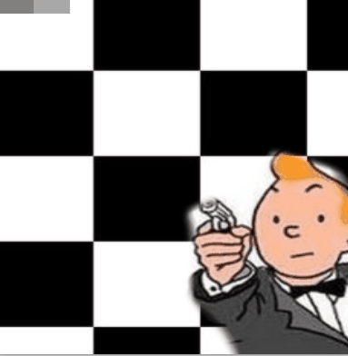
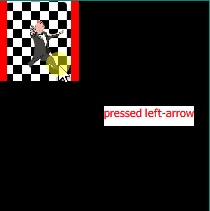

# All about Qt / Qml (youtube -> KDAB)

## Qt (Widgets) vs Qt Quick / qml
* Qt Widgets
    * not optimized for mobile Applications
* Qt Quick / qml / declarative Qt
    * for mobile Applications
    * Intuitice UI
    * Design-oriented (-> designers, not coders should be able to create UIs)
    * Rapid prototyping
    * Easy development (still: business logic should be seperated (e.g. in C++))
    * functions are JS expressions

## Qml Property bindings vs the **imperative** paradigm
* **!** dont bother with implementation details for change-notification (e.g."signal-/slot-connection"), but directly (i.e.  "built into the language") state / **declare** that you want to have a binding x->y
* bindings **!=** assignments, hence ":" instead of "="

## Transformations (`transformation.qml`)
* animated custom Rotation (i.e. nesting of different custom rotation origins)
 ```javascript 
 Item {
    id: outerContainer
    transform: Rotation {
                id: outerRotation;
                origin.x : xPosOuterRotationCenter;
                origin.y : yPosOuterRotationCenter;
                angle:0;
                RotationAnimation on angle {
                    from: 0;
                    to: 360;
                    duration: 60000;
                    loops: Animation.Infinite;
                }
            }
    Item {
        id: innerContainer
        transform: Rotation {
                id: innerRotation;
                origin.x : xPosInnerRotationCenter;
                origin.y : yPosInnerRotationCenter;
                angle:0;
                RotationAnimation on angle {
                    from: 0;
                    to: 360;
                    duration: 60000;
                    loops: Animation.Infinite;
                }
            }
    }
 }
 
 ```


## Anchorsystem (`anchorsystem.qml`)
* behold, the anchorsystem (i.e. margins and anchors)
 ```javascript 
 Item {
        id:anchoredItem;        
        anchors {
            right: outerRightItem.left;
            rightMargin: marginSize;
            top: outerTopItem.bottom;
            topMargin: marginSize;
            left: outerLeftItem.right;
            leftMargin: marginSize;
            bottom: outerBottomItem.top;
            bottomMargin: marginSize;
        }
    }
 ```


## Interaction (`interaction.qml`)
* keyboard, mouse, gesture UI-support
### Flickable (peekhole)
```javascript 
// allow for flicking the Flickable-content with standard mouse "drag" / "flick"
Flickable {
        id: flick
        anchors {
            fill: parent;
        }
        // use the content dimentsions as a peekhole to the larger, "underlying", child-Image
        contentWidth: widerThanFlickable;
        contentHeight:higherThanFlickable;
        // child of the content!
        Image {
            id:background;
            source: imageSource;
            width: flick.contentWidth; 
            height: flick.contentHeight;
        }
    }
```


### Key navigation (arrow-left, -right, -up, -down)
```javascript
Rectangle {
        id: leftTopImageContainer;
        anchors {
            left: root.left;
            top: root.top;
            leftMargin: 20;
            topMargin: 20;
        }
        color: activeFocus? "red" : root.color;
        width: 80;
        height: 80;
        Image {
            anchors {
                fill: parent;
            }
            source: iamgeSource;
            fillMode: Image.PreserveAspectFit
            visible: parent.activeFocus ? true : false;
        }
        // use the KeyNavigation attached properties for conveniently setting the focus to a dedicated item
        //KeyNavigation.right: rightTopImageContainer;
        // use the Keys-attached signal handlers to e.g. trigger a dedicated function or set multiple object-properties (as done here)
        // Key.onSignal: *Container.focus = true is equivalent to KeyNavigation.key: *Container
        Keys.onRightPressed: interactionText.text = "pressed right-arrow", rightTopImageContainer.focus = true;
        Keys.onDownPressed: interactionText.text = "pressed down-arrow", leftBottomImageContainer.focus = true;
        focus: true;
    }
```
